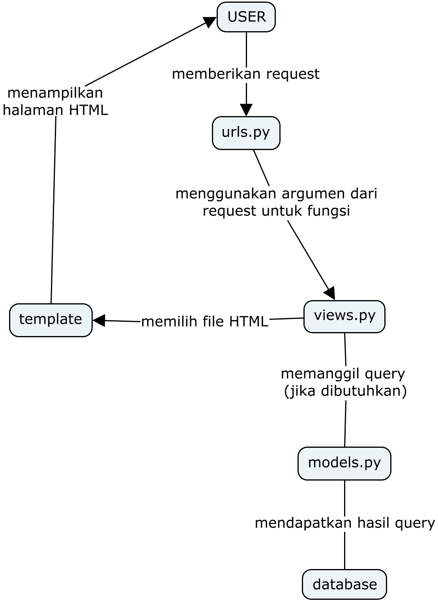

# Link Aplikasi Heroku
katalog page: https://assignment-2-raditya.herokuapp.com/katalog/

main page: https://assignment-2-raditya.herokuapp.com

## Buatlah bagan yang berisi request client ke web aplikasi berbasis Django beserta responnya dan jelaskan pada bagan tersebut kaitan antara urls.py, views.py, models.py, dan berkas html;

Input dari user akan diteruskan dalam bentuk request yang akan diproses oleh ```urls.py``` dan diambil sebagai parameter oleh ```views.py```.  ```views.py``` akan memanggil query ke ```models.py``` yang akan mendapatkan data dari database sesuai dengan query yang didapatkan. Hasil dari query yang telah didapatkan diteruskan ke ```views.py``` untuk memilih ```template```, yang kemudian akan ditampilkan kepada user.

## Jelaskan kenapa menggunakan virtual environment? Apakah kita tetap dapat membuat aplikasi web berbasis Django tanpa menggunakan virtual environment?

Sebenarnya penggunaan virtual environment tidak wajib dalam pembuatan sebuah project Django. Akan tetapi, penggunaan virtual environment juga sangat disarankan karena beberapa hal berikut:

* Tanpa adanya virtual environment, perubahan atau update yang dilakukan terhadap dependencies akan berpengaruh ke environment global PC dan berpotensi mempengaruhi project lain.
* Project yang dikerjakan bisa saja memiliki dependencies yang berbeda-beda. Maka agar tidak mengusik pengaturan OS yang digunakan, dependencies akan diisolasi di dalam virtual environment.
* Misal project ingin dikerjakan pada beberapa PC yang memiliki versi library/package berbeda, akan lebih mudah apabila dependencies sudah diisolasi berdasarkan project tersebut menggunakan virtual environment.

## Jelaskan bagaimana cara kamu mengimplementasikan poin 1 sampai dengan 4 di atas.

#### 1. Membuat sebuah fungsi pada views.py yang dapat melakukan pengambilan data dari model dan dikembalikan ke dalam sebuah HTML.
Pada ```views.py```, dibuat sebuah fungsi yang menerima ```request``` sebagai parameter, kemudian mengembalikan ```render(request, katalog.html, context)```. Fungsi ini akan mengambil request user dan akan memilih template struktur aplikasi sesuai request tersebut.


#### 2. Membuat sebuah routing untuk memetakan fungsi yang telah kamu buat pada views.py.
Poin ini diimplementasikan pada file ```urls.py``` dengan menambahkan 

```
from django.urls import path
from katalog.views import show_katalog

app_name = "katalog"

urlpatterns = [
    path('', show_katalog, name = "show_katalog"),
]
```
Potongan kode tersebut memungkikan ```views.py``` untuk menampilkan halaman HTML yang terdapat di ```template```. Selain itu, harus ditambahkan juga potongan kode ```path('katalog/', include('katalog.urls')),``` pada ```urlpatterns``` di file ```urls.py``` yang terletak pada folder ```project_django```.

#### 3. Memetakan data yang didapatkan ke dalam HTML dengan sintaks dari Django untuk pemetaan data template.
Pada folder ```template```, terdapat sintaks khusus yang dapat digunakan untuk memetakan data yang sudah dirender pada file ```views.py```, yaitu ```{{data}}```. Oleh karena itu, dalam tugas ini untuk memetakan semua data yang diberikan ke dalam HTML bisa dengan cara menambahkan kode berikut di file ```katalog.html```:
```

<tr>
    <th>{{barang.item_name}}</th>
    <th>{{barang.item_price}}</th>
    <th>{{barang.item_stock}}</th>
    <th>{{barang.rating}}</th>
    <th>{{barang.description}}</th>
    <th>{{barang.item_url}}</th>
</tr>

```
Hasil dari kode ini adalah semua data yang ada di ```initial_catalog_cata.json``` akan dipetakan ke dalam HTML.

Setelah semuanya selesai, kita harus migrasi model serta memasukkan data dari ```initial_catalog_cata.json``` ke database lokal Django dengan perintah
```
python manage.py makemigrations
python manage.py migrate
python manage.py loaddata initial_wishlist_data.json
```

#### 4. Melakukan deployment ke Heroku terhadap aplikasi yang sudah kamu buat sehingga nantinya dapat diakses oleh teman-temanmu melalui Internet.
Deployment ke Heroku dimulai dari membuat app di website Heroku. Selanjutnya, kita dapat mengambil API key akun kita dari ```Account Settings``` pada website Heroku. API key serta nama app yang sudah didapatkan akan ditambahkan ke bagian ```secrets``` repository Github. Hal ini akan memungkinkan file ```dpl.yml``` mengambil informasi ```HEROKU_API_KEY``` dan ```HEROKU_APP_NAME``` supaya deployment berjalan dengan lancar.
 
